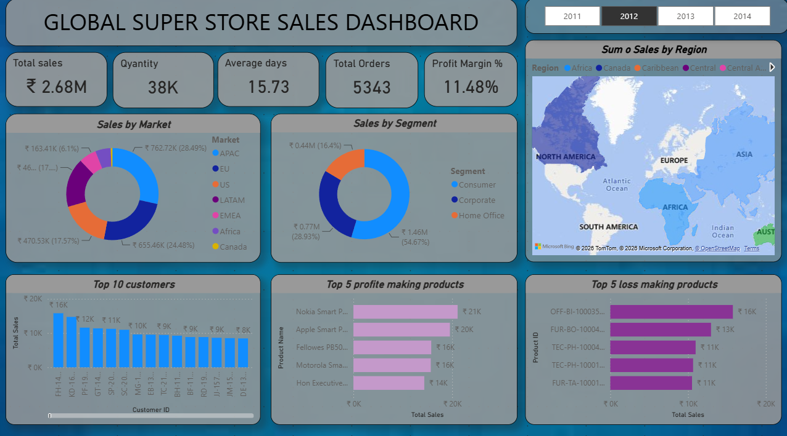

# Global Superstore Sales Analytics

## Project Overview

An interactive sales analytics dashboard built using Microsoft Power BI and DAX using the Global Superstore dataset.

The project focuses on analyzing sales performance, customer trends, product profitability, market performance, and regional sales.

## Tools & Technologies

- Microsoft Power BI
- Power Query
- DAX
- Data Cleaning & Transformation
- Data Visualization
- Business Analysis

## Data Preparation

The dataset was cleaned and transformed using Power Query before building the dashboard.

Key preparation activities included:

- Data cleaning and transformation
- Handling date fields
- Preparing fields for analysis
- Creating calculated measures using DAX

## DAX Measures

DAX was used to create key business metrics including:

- Total Sales
- Total Quantity
- Total Orders
- Total Profit
- Profit Margin %
- Average Days

## Dashboard KPIs

The dashboard provides key performance indicators such as:

- Total Sales
- Total Quantity
- Average Days
- Total Orders
- Profit Margin %

## Dashboard Analysis

The dashboard provides analysis of:

- Sales by Market
- Sales by Segment
- Sales by Region
- Top 10 Customers
- Top 5 Profit-Making Products
- Top 5 Loss-Making Products
- Year-wise Sales Performance

## Interactive Features

- Year slicer
- Interactive filtering
- Regional analysis
- Dynamic KPI cards
- Interactive map visualization

## Dashboard Preview

-

## Key Skills Demonstrated

- Data Cleaning
- Data Transformation
- DAX
- Power BI Dashboard Development
- KPI Development
- Data Visualization
- Business Analysis
- Sales Analytics

## Project Files

- `Global_Superstore_Sales_Analytics.pbix` – Power BI dashboard
- `Global_Superstore_Dashboard1.png` – Dashboard preview
## 📌 Project Outcome

This project demonstrates the use of Power BI and DAX to transform raw sales data into an interactive business dashboard and generate meaningful insights for sales and profitability analysis.
